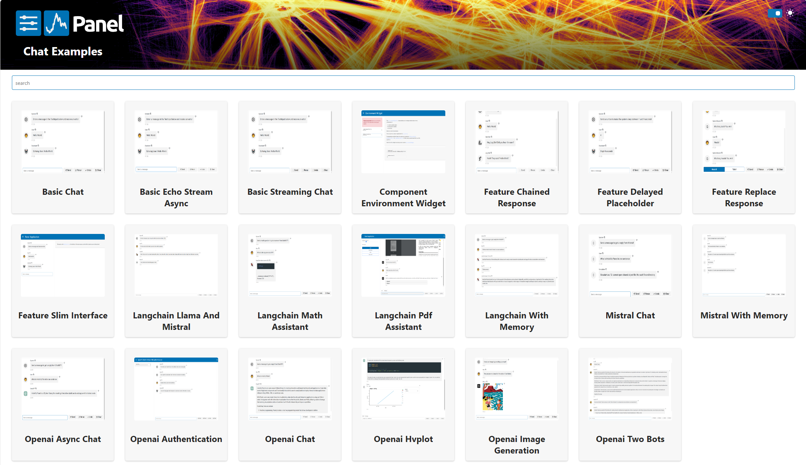

# Panel Chat Examples

This project provides a collection of [examples](examples/index.md) of [Panel](https://panel.holoviz.org/)s
chat features.

The examples are based on the next generation of chat features being developed in [PR #5333](https://github.com/holoviz/panel/pull/5333).

https://github.com/ahuang11/panel-chat-examples/assets/15331990/247ed34a-aa76-4be4-8f83-70aca60af046

Your contributions would mean the world ❤️

Check out the [Gallery](examples/index.md)

THIS PROJECT IS AN EARLY STAGE AND WILL CHANGE!

## Install the examples

Clone the repository

```bash
git clone https://github.com/ahuang11/panel-chat-examples.git
```

Navigate to the repository

```bash
cd panel-chat-examples
```

Create and activate your virtual environment

```bash
python -m venv .venv
source .venv/bin/activate # linux or
source .venv/Scripts/activate # windows git bash
```

Install the requirements

```bash
pip install -r requirements.txt
```

Set the `OPENAI_API_KEY` environment variable.

```bash
export OPENAI_API_KEY='sk-...' # linux or git bash on windows
```

## Serve the examples

Serve the apps

```bash
panel serve examples/**/*.py --static-dirs thumbnails=./assets/thumbnails --autoreload # linux
```

Open [http://localhost:5006](http://localhost:5006).



## Develop

### Install

Follow the installation instructions above. Then run

```bash
pip install -r requirements_dev.txt
```

To be able to run the UI tests, automatically create thumbnails etc you should also install
the playwright dependencies.

```bash
playwright install
```

### Testing

To run the test you should run

```bash
pytest tests
```

To run the playwright tests in *headed* mode (i.e. show the browser) you can run

```bash
pytest tests --headed
```

You can take screenshots via

```bash
SCREENSHOT=true pytest tests --headed
```

The screenshots can be found in tests/ui/screenshots

### Load testing

To ensure the apps can be deployed for example to Hugging Face spaces we need them to load fast.
We can test the loading time with [Locust](https://docs.locust.io/en/stable/index.html).

First you need to [serve the examples](#serve-the-examples).

Then you should run

```bash
locust -f tests/locustfile.py -H http://localhost:5006 --users 1 --spawn-rate 1
```

Finally you can open [http://localhost:8089/](http://localhost:8089/) and click "Start swarming"

You should make sure the RPS (Request per seconds) stay above 1. In the image below its 2.3.


### Pre Commit

Before committing please run

Run

```bash
isort .
black .
python scripts/generate_gallery.py
pytest tests
```

We plan to add pre-commit hooks soon.
