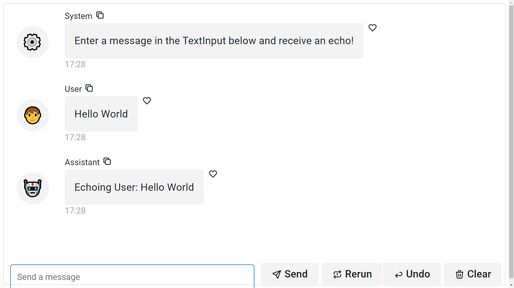
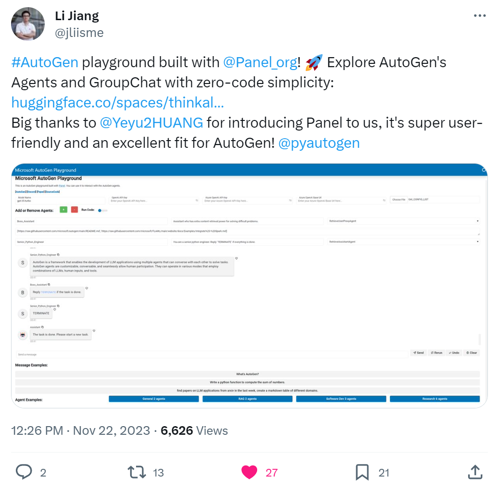
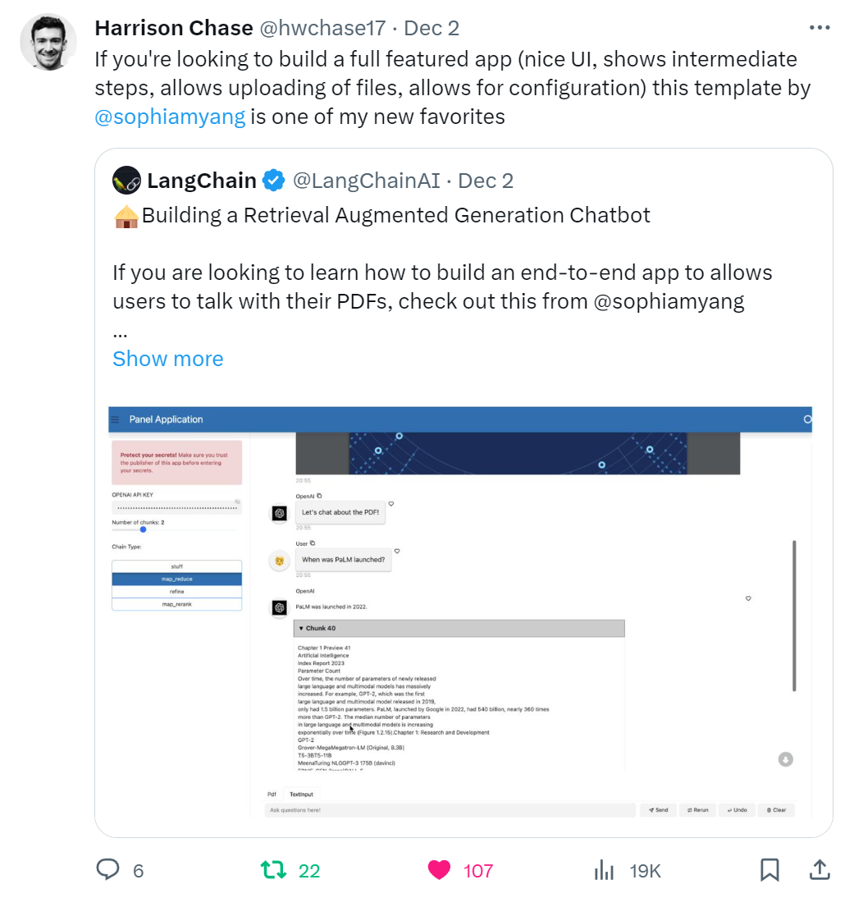
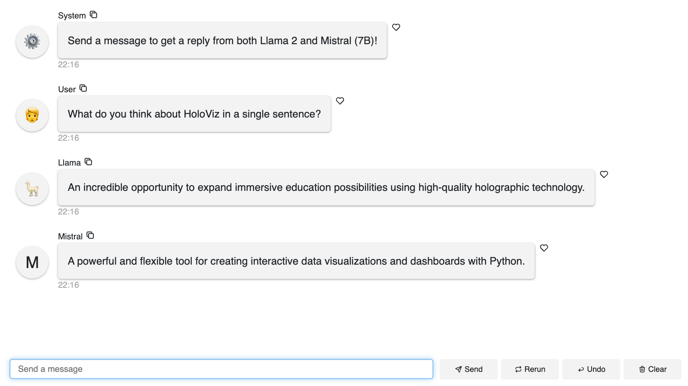

# External Resources

Below we list **awesome external resources**.

## Getting Started

### Panel 1.30 NEW Chat Interface

Author: [Andy Cheung](https://twitter.com/andycheung0211)

Source: [Medium](https://medium.com/@andy456333/holoviz-panel-1-30-new-chat-interface-widget-d78c18f6e244)

### Getting Started Guide by Andrew and Sophia

Authors: [Andrew Huang](https://twitter.com/IAteAnDrew1) | [Sophia Yang](https://twitter.com/sophiamyang)

Link: [Medium](https://sophiamyang.medium.com/how-to-build-your-own-panel-ai-chatbots-ef764f7f114e)

## Autogen

[Autogen](https://microsoft.github.io/autogen/) by Microsoft is  a framework that enables
**development of LLM applications using multiple agents** that can converse with each other to solve
tasks.

### AutoGen Group Chat Playground

Autogen Playground with [endorsement](https://x.com/jliisme/status/1727287346817810847?s=20) by [Li Jiang](https://x.com/jliisme), one of the creators of Autogen.

Author: [Li Jiang](https://x.com/jliisme)

Links: [Hugging Face](https://huggingface.co/spaces/thinkall/AutoGen_Playground)

### Fully Functioning UI for Autogen (ep.1)

Author:  [Yeyu Huang](https://twitter.com/Yeyu2HUANG)

Links: [GitHub](https://github.com/yeyu2/Youtube_demos) | [Medium](https://levelup.gitconnected.com/how-to-create-a-web-ui-for-autogen-132df43fb2ed) | [SubStack](https://yeyu.substack.com/p/how-to-create-a-web-ui-for-autogen) | [YouTube](https://youtu.be/mFmPDyLlj1E?si=62I9vRUI_Y3wnfU1)

<iframe width="560" height="315" src="https://www.youtube.com/embed/mFmPDyLlj1E?si=kcYOMjBs3rTz5SRs" title="YouTube video player" frameborder="0" allow="accelerometer; autoplay; clipboard-write; encrypted-media; gyroscope; picture-in-picture; web-share" allowfullscreen></iframe>

### Fully Functioning UI for Autogen (ep.2)

Author:  [Yeyu Huang](https://twitter.com/Yeyu2HUANG)

Links: [Medium](https://levelup.gitconnected.com/autogens-full-function-ui-powered-by-panel-d00ddecc98ee) | [Substack](https://yeyu.substack.com/p/autogens-full-function-ui-powered?r=21aesy&utm_campaign=post&utm_medium=web) | [YouTube](https://youtu.be/9lSaRP9GLCY?si=RonvtyDOLQCpEOOm)

<iframe width="560" height="315" src="https://www.youtube.com/embed/9lSaRP9GLCY?si=EyqLx-lomgXxqJ-2" title="YouTube video player" frameborder="0" allow="accelerometer; autoplay; clipboard-write; encrypted-media; gyroscope; picture-in-picture; web-share" allowfullscreen></iframe>

## Fleet AI

[Fleet AI](https://twitter.com/fleet_ai) provides high quality embeddings for more than 1000 popular Python libraries including Panel.

### Chat with +1000 Python Libraries

Build a chat bot on top of the Fleet AI embeddings.

Authors: [Andrew Huang](https://twitter.com/IAteAnDrew1) | [Sophia Yang](https://twitter.com/sophiamyang)

Link: [Blog Post](https://blog.holoviz.org/posts/fleet_ai/)

[</img>](https://blog.holoviz.org/posts/fleet_ai/)

## LangChain

### Building a Retrieval Augmented Generation Chatbot

With [endorsement](https://x.com/hwchase17/status/1730990206856437831?s=20) by [Harrison Chase](https://twitter.com/hwchase17) the founder of LangChain.

Authors: [Andrew Huang](https://twitter.com/IAteAnDrew1) | [Sophia Yang](https://twitter.com/sophiamyang)

Links: [Medium](https://sophiamyang.medium.com/building-a-retrieval-augmented-generation-chatbot-d567a24fcd14)

## Mistral

### ChatBot with Mistral and Llama2

Authors: [Andrew Huang](https://twitter.com/IAteAnDrew1) | [Sophia Yang](https://twitter.com/sophiamyang)

Links: [Medium](https://sophiamyang.medium.com/building-ai-chatbots-with-mistral-and-llama2-9c0f5abc296c)

## News Summarizer

The news summarizer app by [Eduardo Blancas](https://github.com/edublancas) is a RAG built *from scratch* without any LLM framework. Its deployed to [Ploomber Cloud](https://ploomber.io/cloud/). The methodology is nicely described in [rag-from-scratch.ipynb](https://github.com/ploomber/doc/blob/main/notebooks/rag-from-scratch.ipynb).

Try asking `What is the latest sports news?`.

<iframe
src="https://ancient-wind-3019.ploomberapp.io/app"
frameborder="0"
style="width:100%;height:600px"
></iframe>

### Talk with Plot

Authors: [Andrew Huang](https://twitter.com/IAteAnDrew1) | [Sophia Yang](https://twitter.com/sophiamyang)

Links: [Blog Post](https://blog.holoviz.org/posts/tweak-mpl-chat/) | [Hugging Face Spaces](https://huggingface.co/spaces/ahuang11/tweak-mpl-chat)

## Ragna

[Ragna](https://ragna.chat/) is an open source RAG orchestration framework. The UI is built on top of Panel.

[</img>](https://ragna.chat/)
