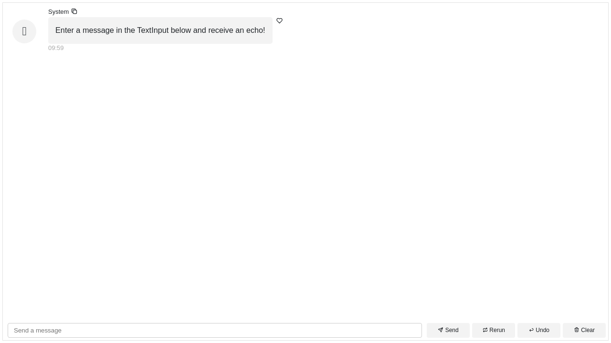
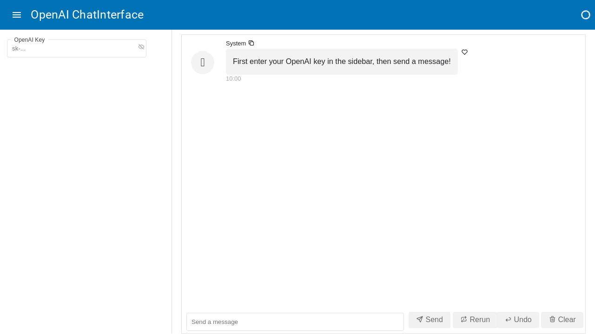

# Panel Chat Examples

To run all of these examples locally:

```bash
git clone https://github.com/holoviz-topics/panel-chat-examples
cd panel-chat-examples
pip install hatch
hatch run panel-serve
```

!!! note
    Note the default installation is not optimized for GPU usage. To **enable
    GPU support** for local models (i.e. not OpenAI), install `ctransformers`
    with the proper backend and modify the
    scripts configs' accordingly, e.g. `n_gpu_layers=1` for a single GPU.

## Basics

### Echo

Demonstrates how to use the `ChatInterface` and a `callback` function to respond.

The chatbot Assistant echoes back the message entered by the User.

[](examples/basics/echo.py)

<details>
<summary>Source code for <a href='examples/basics/echo.py' target='_blank'>echo.py</a></summary>
```python
"""
Demonstrates how to use the `ChatInterface` and a `callback` function to respond.

The chatbot Assistant echoes back the message entered by the User.
"""

import panel as pn

pn.extension()


def callback(contents: str, user: str, instance: pn.widgets.ChatInterface):
    message = f"Echoing {user}: {contents}"
    return message


chat_interface = pn.widgets.ChatInterface(callback=callback)
chat_interface.send(
    "Enter a message in the TextInput below and receive an echo!",
    user="System",
    respond=False,
)
chat_interface.servable()
```
</details>


### Echo Stream

Demonstrates how to use the `ChatInterface` and a `callback` function to stream back
responses.

The chatbot Assistant echoes back the message entered by the User in a *streaming*
fashion.

[](examples/basics/echo_stream.py)

<details>
<summary>Source code for <a href='examples/basics/echo_stream.py' target='_blank'>echo_stream.py</a></summary>
```python
"""
Demonstrates how to use the `ChatInterface` and a `callback` function to stream back
responses.

The chatbot Assistant echoes back the message entered by the User in a *streaming*
fashion.
"""


from time import sleep

import panel as pn

pn.extension()


def callback(contents: str, user: str, instance: pn.widgets.ChatInterface):
    sleep(1)
    message = ""
    for char in contents:
        sleep(0.05)
        message += char
        yield message


chat_interface = pn.widgets.ChatInterface(callback=callback)
chat_interface.send(
    "Enter a message in the TextInput below and receive an echo!",
    user="System",
    respond=False,
)
chat_interface.servable()
```
</details>


## Features

### Chained Response

Demonstrates how to chain responses in a ChatInterface.
<details>
<summary>Source code for <a href='examples/features/chained_response.py' target='_blank'>chained_response.py</a></summary>
```python
"""
Demonstrates how to chain responses in a ChatInterface.
"""

from time import sleep

import panel as pn

pn.extension()

ARM_BOT = "Arm Bot"
LEG_BOT = "Leg Bot"


async def callback(contents: str, user: str, instance: pn.widgets.ChatInterface):
    sleep(1)
    if user == "User":
        yield {
            "user": ARM_BOT,
            "avatar": "🦾",
            "value": f"Hey, {LEG_BOT}! Did you hear the user?",
        }
        instance.respond()
    elif user == ARM_BOT:
        user_entry = instance.value[-3]
        user_contents = user_entry.value
        yield {
            "user": LEG_BOT,
            "avatar": "🦿",
            "value": f'Yeah! They said "{user_contents}".',
        }


chat_interface = pn.widgets.ChatInterface(callback=callback)
chat_interface.send("Send a message!", user="System", respond=False)
chat_interface.servable()
```
</details>


### Delayed Placeholder

Demonstrates how to delay the display of the placeholder.
<details>
<summary>Source code for <a href='examples/features/delayed_placeholder.py' target='_blank'>delayed_placeholder.py</a></summary>
```python
"""
Demonstrates how to delay the display of the placeholder.
"""

from asyncio import sleep

import panel as pn

pn.extension()


async def callback(contents: str, user: str, instance: pn.widgets.ChatInterface):
    try:
        seconds = float(contents)
        if 0 < seconds < 10:
            await sleep(seconds)
            return f"Slept {contents} seconds!"
        else:
            return "Please enter a number between 1 and 9!"
    except ValueError:
        return "Please enter a number!"


chat_interface = pn.widgets.ChatInterface(
    callback=callback,
    placeholder_threshold=2,
    placeholder_text="Waiting for reply...",
)
chat_interface.send(
    "Send a number to make the system sleep between 1 and 9 seconds!",
    user="System",
    respond=False,
)
chat_interface.servable()
```
</details>


### Replace Response

Demonstrates how to update the response of a ChatInterface widget.
<details>
<summary>Source code for <a href='examples/features/replace_response.py' target='_blank'>replace_response.py</a></summary>
```python
"""
Demonstrates how to update the response of a ChatInterface widget.
"""

from asyncio import sleep
from random import choice

import panel as pn

pn.extension()


async def callback(contents: str, user: str, instance: pn.widgets.ChatInterface):
    yield "Let me flip the coin for you..."
    await sleep(1)

    characters = "/|\\_"
    index = 0
    for _ in range(0, 28):
        index = (index + 1) % len(characters)
        yield "\r" + characters[index]
        await sleep(0.005)

    result = choice(["heads", "tails"])
    if result in contents.lower():
        yield f"Woohoo, {result}! You win!"
    else:
        yield f"Aw, got {result}. Try again!"


chat_interface = pn.widgets.ChatInterface(
    widgets=[pn.widgets.RadioButtonGroup(options=["Heads!", "Tails!"])],
    callback=callback,
    callback_user="Game Master",
)
chat_interface.send(
    "Select heads or tails, then click send!", user="System", respond=False
)
chat_interface.servable()
```
</details>


### Slim Interface

Demonstrates how to create a slim ChatInterface widget that fits in the sidebar.
<details>
<summary>Source code for <a href='examples/features/slim_interface.py' target='_blank'>slim_interface.py</a></summary>
```python
"""
Demonstrates how to create a slim ChatInterface widget that fits in the sidebar.
"""
import panel as pn

pn.extension()


async def callback(contents: str, user: str, instance: pn.widgets.ChatInterface):
    message = f"Echoing {user}: {contents}"
    return message


chat_interface = pn.widgets.ChatInterface(
    callback=callback,
    show_send=False,
    show_rerun=False,
    show_undo=False,
    show_clear=False,
    show_button_name=False,
    height=875,
    width=475,
)
chat_interface.send("Send a message and hear an echo!", user="System", respond=False)

pn.template.FastListTemplate(
    main=["# Insert the main content here to chat about it; maybe a PDF?"],
    sidebar=[chat_interface],
    sidebar_width=500,
).servable()
```
</details>


## Langchain

### Chat Memory

Demonstrates how to use the ChatInterface widget to create a chatbot using
OpenAI's GPT-3 API with LangChain.
<details>
<summary>Source code for <a href='examples/langchain/chat_memory.py' target='_blank'>chat_memory.py</a></summary>
```python
"""
Demonstrates how to use the ChatInterface widget to create a chatbot using
OpenAI's GPT-3 API with LangChain.
"""

import panel as pn
from langchain.chains import ConversationChain
from langchain.chat_models import ChatOpenAI
from langchain.memory import ConversationBufferMemory

pn.extension()


async def callback(contents: str, user: str, instance: pn.widgets.ChatInterface):
    await chain.apredict(input=contents)


chat_interface = pn.widgets.ChatInterface(callback=callback, callback_user="ChatGPT")
chat_interface.send(
    "Send a message to get a reply from ChatGPT!", user="System", respond=False
)

callback_handler = pn.widgets.langchain.PanelCallbackHandler(
    chat_interface=chat_interface
)
llm = ChatOpenAI(streaming=True, callbacks=[callback_handler])
memory = ConversationBufferMemory()
chain = ConversationChain(llm=llm, memory=memory)
chat_interface.servable()
```
</details>


### Chroma Pdf Qa

Demonstrates how to use the ChatInterface widget to chat about a PDF using
OpenAI's API with LangChain.
<details>
<summary>Source code for <a href='examples/langchain/chroma_pdf_qa.py' target='_blank'>chroma_pdf_qa.py</a></summary>
```python
"""
Demonstrates how to use the ChatInterface widget to chat about a PDF using
OpenAI's API with LangChain.
"""

import os
import tempfile

import panel as pn
from langchain.chains import RetrievalQA
from langchain.document_loaders import PyPDFLoader
from langchain.embeddings import OpenAIEmbeddings
from langchain.llms import OpenAI
from langchain.text_splitter import CharacterTextSplitter
from langchain.vectorstores import Chroma

pn.extension()


def initialize_chain():
    if key_input.value:
        os.environ["OPENAI_API_KEY"] = key_input.value

    selections = (pdf_input.value, k_slider.value, chain_select.value)
    if selections in pn.state.cache:
        return pn.state.cache[selections]

    chat_input.placeholder = "Ask questions here!"

    # load document
    with tempfile.NamedTemporaryFile("wb", delete=False) as f:
        f.write(pdf_input.value)
    file_name = f.name
    loader = PyPDFLoader(file_name)
    documents = loader.load()
    # split the documents into chunks
    text_splitter = CharacterTextSplitter(chunk_size=1000, chunk_overlap=0)
    texts = text_splitter.split_documents(documents)
    # select which embeddings we want to use
    embeddings = OpenAIEmbeddings()
    # create the vectorestore to use as the index
    db = Chroma.from_documents(texts, embeddings)
    # expose this index in a retriever interface
    retriever = db.as_retriever(
        search_type="similarity", search_kwargs={"k": k_slider.value}
    )
    # create a chain to answer questions
    qa = RetrievalQA.from_chain_type(
        llm=OpenAI(),
        chain_type=chain_select.value,
        retriever=retriever,
        return_source_documents=True,
        verbose=True,
    )
    return qa


async def respond(contents, user, chat_interface):
    if not pdf_input.value:
        chat_interface.send(
            {"user": "System", "value": "Please first upload a PDF!"}, respond=False
        )
        return
    elif chat_interface.active == 0:
        chat_interface.active = 1
        chat_interface.active_widget.placeholder = "Ask questions here!"
        yield {"user": "OpenAI", "value": "Let's chat about the PDF!"}
        return

    qa = initialize_chain()
    response = qa({"query": contents})
    answers = pn.Column(response["result"])
    answers.append(pn.layout.Divider())
    for doc in response["source_documents"][::-1]:
        answers.append(f"**Page {doc.metadata['page']}**:")
        answers.append(f"```\n{doc.page_content}\n```")
    yield {"user": "OpenAI", "value": answers}


pdf_input = pn.widgets.FileInput(accept=".pdf", value="", height=50)
key_input = pn.widgets.PasswordInput(
    name="OpenAI Key",
    placeholder="sk-...",
)
k_slider = pn.widgets.IntSlider(
    name="Number of Relevant Chunks", start=1, end=5, step=1, value=2
)
chain_select = pn.widgets.RadioButtonGroup(
    name="Chain Type", options=["stuff", "map_reduce", "refine", "map_rerank"]
)
chat_input = pn.widgets.TextInput(placeholder="First, upload a PDF!")
chat_interface = pn.widgets.ChatInterface(
    callback=respond, sizing_mode="stretch_width", widgets=[pdf_input, chat_input]
)
chat_interface.send(
    {"user": "System", "value": "Please first upload a PDF and click send!"},
    respond=False,
)
template = pn.template.BootstrapTemplate(
    sidebar=[key_input, k_slider, chain_select], main=[chat_interface]
)
template.servable()
```
</details>


### Llama And Mistral

Demonstrates how to use the ChatInterface widget to create a chatbot using
Llama2.
<details>
<summary>Source code for <a href='examples/langchain/llama_and_mistral.py' target='_blank'>llama_and_mistral.py</a></summary>
```python
"""
Demonstrates how to use the ChatInterface widget to create a chatbot using
Llama2.
"""

import panel as pn
from langchain.chains import LLMChain
from langchain.llms import CTransformers
from langchain.prompts import PromptTemplate

pn.extension()

MODEL_KWARGS = {
    "llama": {
        "model": "TheBloke/Llama-2-7b-Chat-GGUF",
        "model_file": "llama-2-7b-chat.Q5_K_M.gguf",
    },
    "mistral": {
        "model": "TheBloke/Mistral-7B-Instruct-v0.1-GGUF",
        "model_file": "mistral-7b-instruct-v0.1.Q4_K_M.gguf",
    },
}
llm_chains = {}

TEMPLATE = """<s>[INST] You are a friendly chat bot who's willing to help answer the
user:
{user_input} [/INST] </s>
"""


async def callback(contents: str, user: str, instance: pn.widgets.ChatInterface):
    config = {"max_new_tokens": 256, "temperature": 0.5}

    for model in MODEL_KWARGS:
        if model not in llm_chains:
            llm = CTransformers(**MODEL_KWARGS[model], config=config)
            prompt = PromptTemplate(template=TEMPLATE, input_variables=["user_input"])
            llm_chain = LLMChain(prompt=prompt, llm=llm)
            llm_chains[model] = llm_chain
        instance.send(
            await llm_chains[model].apredict(user_input=contents),
            user=model.title(),
            respond=False,
        )


chat_interface = pn.widgets.ChatInterface(callback=callback)
chat_interface.send(
    "Send a message to get a reply from both Llama 2 and Mistral (7B)!",
    user="System",
    respond=False,
)
chat_interface.servable()
```
</details>


### Math Chain

Demonstrates how to use the ChatInterface widget to create
a math chatbot using OpenAI's text-davinci-003 model with LangChain.
<details>
<summary>Source code for <a href='examples/langchain/math_chain.py' target='_blank'>math_chain.py</a></summary>
```python
"""
Demonstrates how to use the ChatInterface widget to create
a math chatbot using OpenAI's text-davinci-003 model with LangChain.
"""

import panel as pn
from langchain.chains import LLMMathChain
from langchain.llms import OpenAI

pn.extension()


async def callback(contents: str, user: str, instance: pn.widgets.ChatInterface):
    final_answer = await llm_math.arun(question=contents)
    instance.stream(final_answer, entry=instance.value[-1])


chat_interface = pn.widgets.ChatInterface(callback=callback, callback_user="Langchain")
chat_interface.send(
    "Send a message to get a reply from ChatGPT!", user="System", respond=False
)

callback_handler = pn.widgets.langchain.PanelCallbackHandler(
    chat_interface=chat_interface
)
llm = OpenAI(streaming=True, callbacks=[callback_handler])
llm_math = LLMMathChain.from_llm(llm, verbose=True)
chat_interface.servable()
```
</details>


## Openai

### Authentication

Demonstrates how to use the ChatInterface widget with authentication for
OpenAI's API.

[](examples/openai/authentication.py)

<details>
<summary>Source code for <a href='examples/openai/authentication.py' target='_blank'>authentication.py</a></summary>
```python
"""
Demonstrates how to use the ChatInterface widget with authentication for
OpenAI's API.
"""

import os

import openai
import panel as pn

SYSTEM_KWARGS = dict(
    user="System",
    respond=False,
)


def add_key_to_env(key):
    if not key.startswith("sk-"):
        chat_interface.send("Please enter a valid OpenAI key!", **SYSTEM_KWARGS)
        return

    os.environ["OPENAI_API_KEY"] = key
    chat_interface.send(
        "Your OpenAI key has been set. Feel free to minimize the sidebar.",
        **SYSTEM_KWARGS,
    )
    chat_interface.disabled = False


async def callback(
    contents: str,
    user: str,
    instance: pn.widgets.ChatInterface,
):
    if "OPENAI_API_KEY" not in os.environ:
        yield "Please first set your OpenAI key in the sidebar!"
        return

    response = await openai.ChatCompletion.acreate(
        model="gpt-3.5-turbo",
        messages=[{"role": "user", "content": contents}],
        stream=True,
    )
    message = ""
    async for chunk in response:
        message += chunk["choices"][0]["delta"].get("content", "")
        yield message


key_input = pn.widgets.PasswordInput(placeholder="sk-...", name="OpenAI Key")
pn.bind(add_key_to_env, key=key_input, watch=True)

chat_interface = pn.widgets.ChatInterface(callback=callback, disabled=True)
chat_interface.send(
    "First enter your OpenAI key in the sidebar, then send a message!", **SYSTEM_KWARGS
)

pn.template.MaterialTemplate(
    title="OpenAI ChatInterface",
    sidebar=[key_input],
    main=[chat_interface],
).servable()
```
</details>


### Chat

Demonstrates how to use the ChatInterface widget to create a chatbot using
OpenAI's GPT-3 API.
<details>
<summary>Source code for <a href='examples/openai/chat.py' target='_blank'>chat.py</a></summary>
```python
"""
Demonstrates how to use the ChatInterface widget to create a chatbot using
OpenAI's GPT-3 API.
"""

import openai
import panel as pn

pn.extension()


async def callback(contents: str, user: str, instance: pn.widgets.ChatInterface):
    response = openai.ChatCompletion.create(
        model="gpt-3.5-turbo",
        messages=[{"role": "user", "content": contents}],
        stream=True,
    )
    message = ""
    for chunk in response:
        message += chunk["choices"][0]["delta"].get("content", "")
        yield message


chat_interface = pn.widgets.ChatInterface(callback=callback, callback_user="ChatGPT")
chat_interface.send(
    "Send a message to get a reply from ChatGPT!", user="System", respond=False
)
chat_interface.servable()
```
</details>


### Chat Async

Demonstrates how to use the ChatInterface widget to create a chatbot using
OpenAI's GPT-3 API with async/await.
<details>
<summary>Source code for <a href='examples/openai/chat_async.py' target='_blank'>chat_async.py</a></summary>
```python
"""
Demonstrates how to use the ChatInterface widget to create a chatbot using
OpenAI's GPT-3 API with async/await.
"""

import openai
import panel as pn

pn.extension()


async def callback(contents: str, user: str, instance: pn.widgets.ChatInterface):
    response = await openai.ChatCompletion.acreate(
        model="gpt-3.5-turbo",
        messages=[{"role": "user", "content": contents}],
        stream=True,
    )
    message = ""
    async for chunk in response:
        message += chunk["choices"][0]["delta"].get("content", "")
        yield message


chat_interface = pn.widgets.ChatInterface(callback=callback, callback_user="ChatGPT")
chat_interface.send(
    "Send a message to get a reply from ChatGPT!", user="System", respond=False
)
chat_interface.servable()
```
</details>


### Image

Demonstrates how to use the ChatInterface widget to create an image using
OpenAI's DALL-E API.
<details>
<summary>Source code for <a href='examples/openai/image.py' target='_blank'>image.py</a></summary>
```python
"""
Demonstrates how to use the ChatInterface widget to create an image using
OpenAI's DALL-E API.
"""

import openai
import panel as pn

pn.extension()


def callback(contents: str, user: str, instance: pn.widgets.ChatInterface):
    response = openai.Image.create(prompt=contents, n=1, size="256x256")
    image_url = response["data"][0]["url"]
    return pn.pane.Image(image_url, width=256, height=256)


chat_interface = pn.widgets.ChatInterface(
    callback=callback, callback_user="DALL-E", placeholder_text="Generating..."
)
chat_interface.send(
    "Create an image by providing a prompt!", user="System", respond=False
)
chat_interface.servable()
```
</details>


### Two Bots

Demonstrates how to use the ChatInterface widget to create two bots that
chat with each other.
<details>
<summary>Source code for <a href='examples/openai/two_bots.py' target='_blank'>two_bots.py</a></summary>
```python
"""
Demonstrates how to use the ChatInterface widget to create two bots that
chat with each other.
"""

import openai
import panel as pn

pn.extension()


async def callback(
    contents: str,
    user: str,
    instance: pn.widgets.ChatInterface,
):
    if user in ["User", "Happy Bot"]:
        callback_user = "Nerd Bot"
        callback_avatar = "🤓"
    elif user == "Nerd Bot":
        callback_user = "Happy Bot"
        callback_avatar = "😃"

    prompt = f"Think profoundly about {contents}, then ask a question."
    response = await openai.ChatCompletion.acreate(
        model="gpt-3.5-turbo",
        messages=[{"role": "user", "content": prompt}],
        stream=True,
        max_tokens=250,
        temperature=0.1,
    )
    message = ""
    async for chunk in response:
        message += chunk["choices"][0]["delta"].get("content", "")
        yield {"user": callback_user, "avatar": callback_avatar, "value": message}

    if len(instance.value) % 6 == 0:  # stop at every 6 messages
        instance.send(
            "That's it for now! Thanks for chatting!", user="System", respond=False
        )
        return
    instance.respond()


chat_interface = pn.widgets.ChatInterface(callback=callback)
chat_interface.send(
    "Enter a topic for the bots to discuss! Beware the token usage!",
    user="System",
    respond=False,
)
chat_interface.servable()
```
</details>


### Upload

Demonstrates how to use the ChatInterface widget to create a chatbot
that can generate plots using hvplot.
<details>
<summary>Source code for <a href='examples/openai/upload.py' target='_blank'>upload.py</a></summary>
```python
"""
Demonstrates how to use the ChatInterface widget to create a chatbot
that can generate plots using hvplot.
"""

import re
from typing import Union

import openai
import pandas as pd
import panel as pn
from panel.io.mime_render import exec_with_return

DATAFRAME_PROMPT = """
    Here are the columns in your DataFrame: {columns}.
    Create a plot with hvplot that highlights an interesting
    relationship between the columns with hvplot groupby kwarg.
"""

CODE_REGEX = re.compile(r"```python(.*?)```", re.DOTALL)


async def respond_with_openai(contents: Union[pd.DataFrame, str]):
    # extract the DataFrame
    if isinstance(contents, pd.DataFrame):
        global df
        df = contents
        columns = contents.columns
        message = DATAFRAME_PROMPT.format(columns=columns)
    else:
        message = contents

    response = await openai.ChatCompletion.acreate(
        model="gpt-3.5-turbo",
        messages=[{"role": "user", "content": message}],
        temperature=0,
        max_tokens=500,
        stream=True,
    )
    message = ""
    async for chunk in response:
        message += chunk["choices"][0]["delta"].get("content", "")
        yield {"user": "ChatGPT", "value": message}


async def respond_with_executor(code: str):
    code_block = f"```python\n{code}\n```"
    return {
        "user": "Executor",
        "value": pn.Tabs(
            ("Plot", exec_with_return(code=code, global_context=globals())),
            ("Code", code_block),
        ),
    }


async def callback(
    contents: Union[str, pd.DataFrame],
    name: str,
    instance: pn.widgets.ChatInterface,
):
    if not isinstance(contents, (str, pd.DataFrame)):
        return

    if name == "User":
        async for chunk in respond_with_openai(contents):
            yield chunk
        instance.respond()
    elif CODE_REGEX.search(contents):
        yield await respond_with_executor(CODE_REGEX.search(contents).group(1))


chat_interface = pn.widgets.ChatInterface(
    widgets=[pn.widgets.TextInput(), pn.widgets.FileInput()],
    callback=callback,
)
chat_interface.send(
    "Send a message to ChatGPT or upload a CSV file to get started!",
    user="System",
    respond=False,
)
chat_interface.servable()
```
</details>

