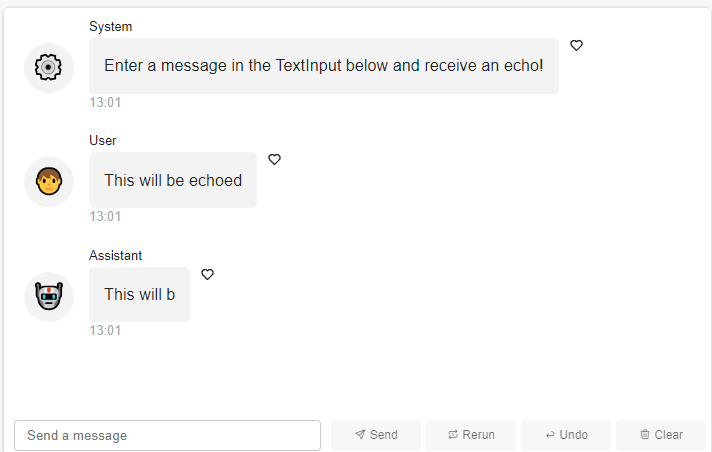
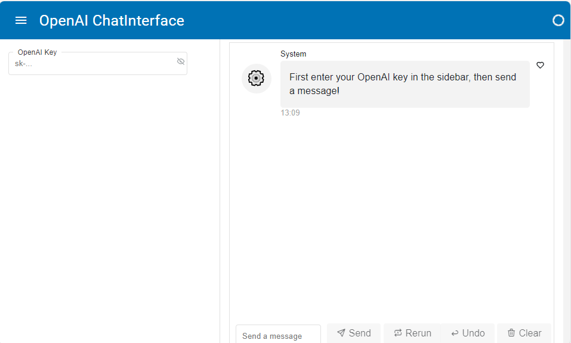

# Panel Chat Examples Gallery

## Basics

### Echo

Demonstrates how to use the `ChatInterface` and a `callback` function to respond.

The chatbot Assistant echoes back the message entered by the User.

Source: [basics/echo.py](basics/echo.py)

### Echo Stream

Demonstrates how to use the `ChatInterface` and a `callback` function to stream back responses.

The chatbot Assistant echoes back the message entered by the User in a *streaming* fashion.

Source: [basics/echo_stream.py](basics/echo_stream.py)

## Features

### Chained Response

Demonstrates how to chain responses in a ChatInterface.

Source: [features/chained_response.py](features/chained_response.py)

### Delayed Placeholder

Demonstrates how to delay the display of the placeholder.

Source: [features/delayed_placeholder.py](features/delayed_placeholder.py)

### Replace Response

Demonstrates how to update the response of a ChatInterface widget.

Source: [features/replace_response.py](features/replace_response.py)

### Slim Interface

Demonstrates how to create a slim ChatInterface widget that fits in the sidebar.

Source: [features/slim_interface.py](features/slim_interface.py)

## Langchain

### Chat Memory

Demonstrates how to use the ChatInterface widget to create a chatbot using
OpenAI's GPT-3 API with LangChain.

Source: [langchain/chat_memory.py](langchain/chat_memory.py)

### Chroma Pdf Qa

Demonstrates how to use the ChatInterface widget to chat about a PDF using
OpenAI's API with LangChain.

Source: [langchain/chroma_pdf_qa.py](langchain/chroma_pdf_qa.py)

### Llama And Mistral

Demonstrates how to use the ChatInterface widget to create a chatbot using
Llama2.

Source: [langchain/llama_and_mistral.py](langchain/llama_and_mistral.py)

### Math Chain

Demonstrates how to use the ChatInterface widget to create
a math chatbot using OpenAI's text-davinci-003 model with LangChain.

Source: [langchain/math_chain.py](langchain/math_chain.py)

## Openai

### Authentication

Demonstrates how to use the ChatInterface widget with authentication for
OpenAI's API.

Source: [openai/authentication.py](openai/authentication.py)

### Chat

Demonstrates how to use the ChatInterface widget to create a chatbot using
OpenAI's GPT-3 API.

Source: [openai/chat.py](openai/chat.py)

### Chat Async

Demonstrates how to use the ChatInterface widget to create a chatbot using
OpenAI's GPT-3 API with async/await.

Source: [openai/chat_async.py](openai/chat_async.py)

### Image

Demonstrates how to use the ChatInterface widget to create an image using
OpenAI's DALL-E API.

Source: [openai/image.py](openai/image.py)

### Two Bots

Demonstrates how to use the ChatInterface widget to create two bots that
chat with each other.

Source: [openai/two_bots.py](openai/two_bots.py)

### Upload

Demonstrates how to use the ChatInterface widget to create a chatbot
that can generate plots using hvplot.

Source: [openai/upload.py](openai/upload.py)
